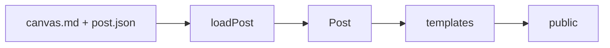

# AGENTS.md

Guidance for agents changing `ssg`.

## Purpose

`ssg` is a small TypeScript static-site generator. Keep it inspectable. A feature belongs when it preserves a short path from authored content to generated HTML.

## Core invariants

- Canvas posts are the supported authored input: `content/posts/<slug>/post.json` and `canvas.md`.
- `loadPost()` normalizes authored input into the `Post` model. Templates consume that model; they do not parse content.
- `buildSite()` is the only build path. `dev` invokes the same build path, then serves and watches its output.
- `public/` and `.ssg/` are generated and must not be committed.
- Templates own presentation. Source modules own parsing, state, routing, and rendering.
- Keep dependencies small. Prefer platform APIs and small local functions over framework layers.

## Repository map

- `src/lib/post.ts` — canvas parsing, Markdown rendering, Mermaid, annotations, and layout data.
- `src/lib/site.ts` — site build, template context, generated markup, Mermaid and MathJax runtime configuration.
- `src/lib/state.ts` — content hashes and post timestamps.
- `src/commands/` — CLI commands.
- `templates/` — default HTML, theme CSS, and optional font CSS/assets.
- `tests/` — behavior-level tests. Add or update tests with behavior changes.

## Change workflow

1. Read the related source module and test first.
2. State the affected invariant.
3. Make the smallest coherent change.
4. Run `npm run build`, `npm test`, and `npx tsc --noEmit`.
5. Do not add sample posts or generated output to the repository. Use temporary test fixtures.

## Typography and external runtime assets

- `site.font` may reference a template CSS file or font asset. The builder copies it into `public/`.
- The default `fonts/iosevka.css` uses Fontsource via jsDelivr and defines `--ssg-prose-font` and `--ssg-mono-font`.
- Mermaid and MathJax are runtime CDN dependencies configured in `src/lib/site.ts`. Keep their configuration centralized there.
