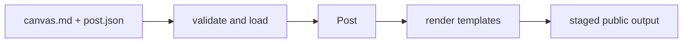

# AGENTS.md

Instructions for agents changing `ssg`.

## Objective

`ssg` is a small TypeScript compiler for canvas posts. Keep the authored-input-to-HTML path short, explicit, and testable. Add a feature only when its model, ownership, and failure mode are clear.



## Supported authoring contract

Posts and pages are canvas document directories:

```txt
content/posts/<slug>/post.json
content/posts/<slug>/canvas.md
content/pages/<slug>/page.json
content/pages/<slug>/canvas.md
content/meditations/<slug>.md
```

Posts enter the root curated index. Pages render at routes without entering that index. Meditations are single Markdown files with strict `title` and `date` front matter; they enter the paginated `/meditations/` index.

- `canvas.md` is required.
- `post.json` is strict: `title`, `createdAt`, `slug`, `panes`, and `layout` are the supported keys.
- `createdAt` is written once by `ssg new`, preserved by forced regeneration, and used to order the post index by recency. Authors do not maintain it manually.
- When `panes` is present, it declares exactly `index`, `canvas`, and `annotations`.
- The only layout preset is `canvas`.
- Post-local non-Markdown/non-JSON files are assets and are copied to the generated post route.
- Canvas Markdown may reference a post-local dialogue with `[[dialogue:file.json]]`. Dialogue JSON is validated, rendered as native collapsible HTML, and never copied as a public asset.
- Dialogue paths must remain inside the post directory after lexical and real-path resolution.
- Meditation filenames define their slugs. The slug `page` is reserved for pagination.
- Meditation indexes contain 20 entries per page and sort by date descending.
- Markdown in canvases, meditations, annotations, and dialogue bodies is trusted local author input. Raw HTML is allowed. Do not use this generator for untrusted content without adding sanitization.

## Core invariants

- `loadPost()` validates and normalizes authored input into `Post`. Templates consume `Post`; they do not parse source files.
- Posts and pages share one route namespace. A slug maps to exactly one route. Duplicate slugs fail before output mutation. The root slug `meditations` is reserved.
- Pane files and copied assets must remain inside their post directory after both lexical and real-path resolution.
- `outputDir` must not overlap `postsDir` or `templatesDir` and must not equal `sourceDir`.
- `buildSite()` is the only rendering path. `dev` invokes that path and only adds watch, serving, and reload behavior.
- Builds render into a sibling staging directory before replacing `public/`.
- Builds are stateless: authored content and configuration are the only durable inputs. Creation time belongs to each post's authored metadata rather than build state.
- `public/` is generated and must not be committed in this repository.

## Repository map

| Area | Responsibility |
|---|---|
| `src/config.ts` | Config loading, validation, path resolution |
| `src/lib/post.ts` | Post validation, Markdown, Mermaid, annotations, canvas model |
| `src/lib/meditation.ts` | Meditation front matter, Markdown, and discovery |
| `src/lib/site.ts` | Build orchestration, routes, assets, pagination, template context, browser runtime configuration |
| `src/commands/` | CLI entry points and dev server |
| `templates/` | Default presentation and optional font assets |
| `tests/` | Behavioral contracts; use temporary fixtures only |

## Change protocol

1. Never mutate `main` directly. Create a focused local branch, commit there, push it, and open a pull request.
2. Observe every required pull-request check through completion. Merge only after all checks succeed; investigate failures instead of bypassing or prematurely merging around them. After merging, observe the complete `main` validation and release pipelines and report any warnings or failures.
3. Read the affected module, its tests, and this contract.
4. State the invariant being changed or introduced.
5. Make the smallest coherent implementation.
6. Add a regression test for each correctness or security boundary.
7. Run:

   ```bash
   npm test
   npx tsc --noEmit
   npm run build
   ```

8. Do not add sample posts or generated output to the repository.
9. Keep temporary feature state under `anvil/`. It is ignored local workspace state and must never become an input required for a clean build.
10. Use `[skip ci]` only for changes that cannot affect validation, builds, generated artifacts, or deployment behavior.

## Mutual development and CI

- The SSG and blog are independently versioned repositories developed against each other.
- SSG CI must preserve focused fixtures and unit tests, then dogfood the exact SSG revision under test by building the blog's `master` branch.
- Blog CI checks both its lockfile-pinned SSG dependency and compatibility with the current SSG `main` branch.
- A mutable cross-repository branch is a compatibility target, not a reproducible dependency. Pin durable inputs by lockfile or commit.
- Cross-repository checks do not replace regression tests. A blog failure can reveal integration breakage but may not identify the violated SSG invariant.
- CI caches are disposable accelerators. Tests and builds must succeed from clean checkouts without previously carried state.
- Merges to `main` occur only through pull requests and are the boundary for complete release or deployment pipelines.

## External assets and runtime

- `site.theme` and `site.font` may refer to template-local assets. The builder copies them into output.
- The default `fonts/iosevka.css` loads Fontsource through jsDelivr and defines `--ssg-prose-font` and `--ssg-mono-font`.
- Mermaid and MathJax are pinned CDN dependencies configured centrally in `src/lib/site.ts`.
- Keep browser behavior separate from parsing and build semantics. The current runtime string in `site.ts` is a known extraction target.
