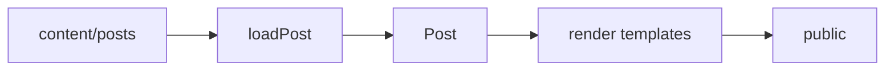

# ssg

[](https://github.com/rajp152k/ssg/actions/workflows/ci.yml)

A small TypeScript static-site generator for canvas-style Markdown posts.

## Model



`canvas.md` contains prose. `post.json` declares the canvas model. The builder validates each post, normalizes it into one `Post` model, and renders HTML through a staging directory.

## Content formats

Posts appear in the site index, newest first. `ssg new` writes each post's immutable `createdAt` timestamp into `post.json`:

```txt
content/posts/my-topic/
  post.json
  canvas.md
```

Pages share the canvas renderer without appearing in the post index:

```txt
content/pages/about/
  page.json
  canvas.md
```

Meditations form a separate, paginated text channel under `/meditations/`:

```md
---
title: A quiet morning
date: 2026-07-19
---

The meditation begins here.
```

Create one with `ssg new-meditation "A quiet morning"`. Meditation front matter is intentionally limited to `title` and `date`; entries are ordered newest-first and paginated after 20 entries.

```json
{
  "title": "My Topic",
  "createdAt": "2026-07-15T07:09:07.000Z",
  "panes": [
    { "id": "index", "title": "Index", "generated": "index", "source": "canvas" },
    { "id": "canvas", "title": "Canvas", "file": "canvas.md" },
    { "id": "annotations", "title": "Annotations", "generated": "annotations", "source": "canvas" }
  ],
  "layout": { "preset": "canvas" }
}
```

Canvas headings generate the index. Notes generate the annotation rail:

```md
A short claim. [[note: Supporting context.]]

A reference. [[@detail]]

[[annotation:detail]]
Longer supporting context.
[[/annotation]]
```

A canvas can embed a collapsible, attributed dialogue from a JSON file in the same document directory:

```md
[[dialogue:review.json]]
```

```json
{
  "title": "Reviewing the central claim",
  "claim": "The claim under review.",
  "turns": [
    { "speaker": "H.A.R.T.", "body": "A Markdown formulation." },
    { "speaker": "C.A.R.R.", "body": "A Markdown challenge." }
  ],
  "disposition": {
    "status": "narrowed",
    "by": "Raj",
    "body": "Why the challenge changed the claim."
  },
  "canvasConsequence": "The revision made to the converged narrative."
}
```

`title` and at least one turn are required. Supported disposition statuses are `accepted`, `narrowed`, `rejected`, `deferred`, `unresolved`, and `revised`. Dialogue references cannot leave the document directory. Dialogue JSON is compiled into HTML rather than copied publicly.

Markdown supports Mermaid fences, LaTeX through MathJax, fenced code blocks, captioned images, and post-local assets. Any non-Markdown/non-JSON file in a post directory is copied to that post's generated route.

## Trust boundary

Posts are trusted local author input. Markdown may contain raw HTML and is rendered without sanitization. Do not build untrusted Markdown with this generator.

## Commands

```bash
npm install
npm run build
npm run dev
npx tsx src/cli.ts new-meditation "Meditation title"
npm test
```

`build` renders into staging and replaces `public/` after a successful build. `dev` builds, watches content/templates/config, serves the output, and live-reloads the browser. Restart `dev` after changing content paths, output path, host, or port.

## Configuration

`ssg.config.json` controls site metadata and paths:

```json
{
  "site": {
    "title": "My Site",
    "author": "Author",
    "theme": "themes/modern-dark.css",
    "font": "fonts/iosevka.css"
  },
  "paths": {
    "postsDir": "content/posts",
    "pagesDir": "content/pages",
    "meditationsDir": "content/meditations",
    "templatesDir": "templates",
    "outputDir": "public"
  }
}
```

Template variables include `{{site_title}}`, `{{site_author}}`, `{{site_footer}}`, `{{css_import}}`, and `{{font_import}}`.

## Development

Read [`AGENTS.md`](AGENTS.md) before changing the generator. It records the architecture, invariants, and required checks.
