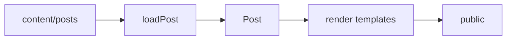

# ssg

[](https://github.com/rajp152k/ssg/actions/workflows/ci.yml)

A small TypeScript static-site generator for canvas-style Markdown posts.

## Model



`canvas.md` contains prose. `post.json` declares the canvas model. The builder validates each post, normalizes it into one `Post` model, updates content state, and renders HTML through a staging directory.

## Post format

```txt
content/posts/my-topic/
  post.json
  canvas.md
```

```json
{
  "title": "My Topic",
  "panes": [
    { "id": "index", "title": "Index", "generated": "index", "source": "canvas" },
    { "id": "canvas", "title": "Canvas", "file": "canvas.md" },
    { "id": "annotations", "title": "Annotations", "generated": "annotations", "source": "canvas" }
  ],
  "layout": { "preset": "canvas" }
}
```

Canvas headings generate the index. Notes generate the annotation rail:

```md
A short claim. [[note: Supporting context.]]

A reference. [[@detail]]

[[annotation:detail]]
Longer supporting context.
[[/annotation]]
```

Markdown supports Mermaid fences, LaTeX through MathJax, fenced code blocks, captioned images, and post-local assets. Any non-Markdown/non-JSON file in a post directory is copied to that post's generated route.

## Trust boundary

Posts are trusted local author input. Markdown may contain raw HTML and is rendered without sanitization. Do not build untrusted Markdown with this generator.

## Commands

```bash
npm install
npm run build
npm run dev
npm test
```

`build` renders into staging and replaces `public/` after a successful build. `dev` builds, watches content/templates/config, serves the output, and live-reloads the browser. Restart `dev` after changing content paths, output path, host, or port.

## Configuration

`ssg.config.json` controls site metadata and paths:

```json
{
  "site": {
    "title": "My Site",
    "author": "Author",
    "theme": "themes/light.css",
    "font": "fonts/iosevka.css"
  },
  "paths": {
    "postsDir": "content/posts",
    "templatesDir": "templates",
    "outputDir": "public"
  }
}
```

Template variables include `{{site_title}}`, `{{site_author}}`, `{{site_footer}}`, `{{css_import}}`, and `{{font_import}}`.

## Development

Read [`AGENTS.md`](AGENTS.md) before changing the generator. It records the architecture, invariants, and required checks.
