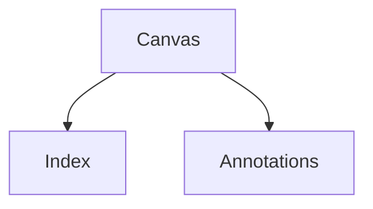

# Canvas Layout

The canvas is the primary authored surface. [[note: This layout replaces the old side-by-side human/agent comparison with one central surface and two derived rails.]]

## Problem statement

The main reading experience should sit in the center. The left rail is an index generated from headings, and the right rail is immediate commentary generated from inline annotation markers. [[@rails]]

[[annotation:rails]]
The rails are navigational/contextual affordances. They are not named as panes in the reader-facing language; the UI should feel like a canvas with an index and annotations.
[[/annotation]]

## Annotation notation

Short commentary can stay inline with a compact marker. [[note: Inline notes are best for one or two sentences.]]

Longer commentary can use a stable reference marker, with its body declared elsewhere in the same canvas document. [[@scroll-lock]]

[[annotation:scroll-lock]]
The annotation rail should scroll-lock to the canvas. As the reader scrolls the canvas, the nearest active annotation is highlighted and brought into view on the right.
[[/annotation]]

## Scroll behavior

The canvas owns scroll position. The annotation rail follows it, rather than acting as an independent primary reading surface.

### Practical effect

When an annotation marker crosses the upper-middle reading band, the corresponding note on the right becomes active.

## Niceties

A canvas can include diagrams:



It can include math like $E = mc^2$ or display equations:

$$
a^2 + b^2 = c^2
$$

It can include syntax-highlight-ready code blocks:

```ts
const surface = 'canvas';
const rails = ['index', 'annotations'];
```

And it can include boxed images with captions:


## Closing

This keeps authoring simple: write one canvas, add inline notes where commentary belongs, and let the build derive the index and annotation rail.
