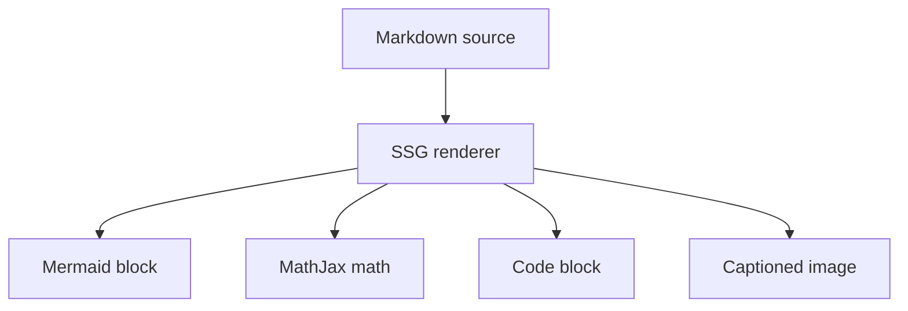

This post is a visual smoke test for the basic Markdown niceties supported by the generator: Mermaid diagrams, LaTeX math, syntax-highlight-ready code fences, and boxed images with captions.

## Mermaid



## LaTeX math

Inline math should stay readable: $E = mc^2$.

Display math should be picked up by MathJax:

$$
\int_0^1 x^2\,dx = \frac{1}{3}
$$

## Syntax block

```ts
type Nicety = 'mermaid' | 'latex' | 'code' | 'image';

const enabled: Nicety[] = ['mermaid', 'latex', 'code', 'image'];

for (const feature of enabled) {
  console.log(`render ${feature}`);
}
```

## Boxed image with caption

The image title is preferred as the figure caption:


If no title is present, the alt text becomes the caption:


## Combined note

This page should make regressions obvious during manual review: the diagram should render, math should typeset, the TypeScript block should remain formatted, and images should sit inside bordered figure boxes with captions.
